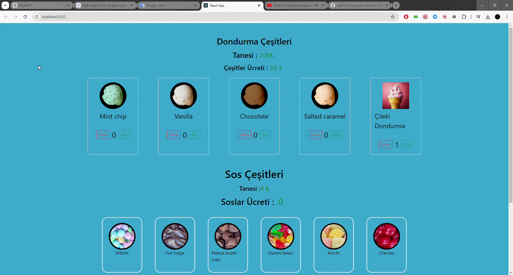

# ICE CREAM

 Unit test kullanılarak bir proje yapılmıştır.

# KÜTÜPHANELERİN SÜRÜMÜ

- axios@^0.27.2
- @testing-library/user-event@14.0
- json-server
- boostsrap
# Test geliştirme süreçleri 

 # TDD  (Test Driven Development)

 - Red to green test 
 - Önce özelliğin / bileşenin testi yazılır. ardından bileşen  / özellik kodlanır.

 - Artısı , testler bir yük gibi gelmez . Geliştirme sürecinin bir parçası olur .

 ## BDD (Behaviour Driven Development)

 - Önce özellik / bileşen geliştirilir sonra testleri yapılır.

 # KULLANICI ETKİLEŞİMİ TETİKLEME

 - Unit test yazarken kullanıcının etkileşimi tetiklemenın 2 yolu vardır.

   
   # PROJE GİF 
 
 <h1>Proje Gif</h1>

  ## Fireevent

  -  rtl içerisinde gelen olay tetikleme methodu gerçek kullanıcıdan uzak tepkiler verdiği için artık yerini userevente bırakmıştir..
 - Tetiklenen olaylar gerçek bir insanın tepkimesınden cok daha hızlı bir şekilde gerçekleşir.

## UserEvent

- Bu yolu kullanmak için userevet paketi indirilmeli
- Fireevent in modern çözümü 
- Tetiklendiğimi olaylar gerçek kullanıcının yapıcağı gibi belirli bir gecikmenin ardından gerçekleşir.
- Gecikme olduğu için async await kullanılır..

